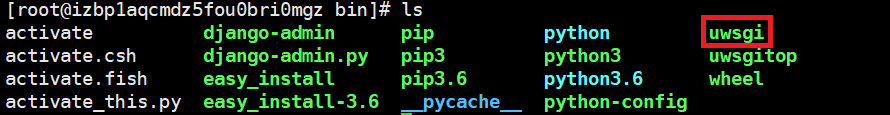
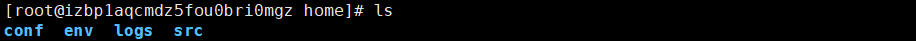
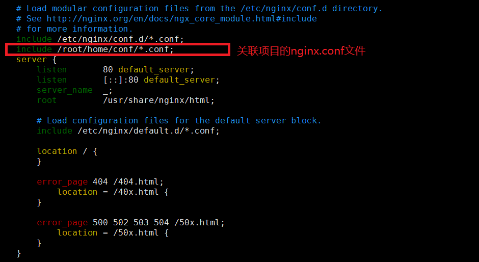
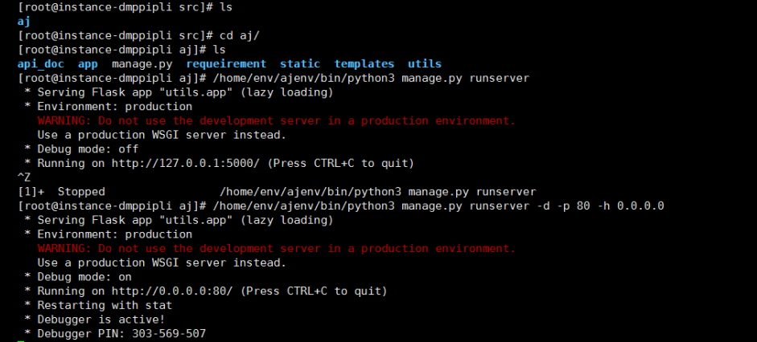
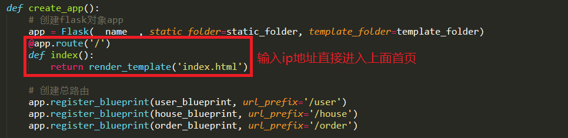

# Linux操作系统 - 部署django和Flask项目


## 1.配置MariaDB

#### (1)安装命令

```shell
yum -y install mariadb mariadb-server

# 启动MariaDB
systemctl start mariadb

# 设置开机启动
systemctl enable mariadb
```

#### (2)设置密码

```python
命令: mysql_secure_installation

Enter current password for root:<–初次运行直接回车

# 设置密码
Set root password? [Y/n] <– 是否设置root用户密码，输入y并回车或直接回车

New password: <– 设置root用户的密码
Re-enter new password: <– 再输入一次你设置的密码

# 其他配置
Remove anonymous users? [Y/n] <– 是否删除匿名用户，回车

Disallow root login remotely? [Y/n] <–是否禁止root远程登录,回车,

Remove test database and access to it? [Y/n] <– 是否删除test数据库，回车

Reload privilege tables now? [Y/n] <– 是否重新加载权限表，回车

# 初始化MariaDB完成，接下来测试登录

mysql -u root -p
```

#### (3)开启远程连接

```shell
在mysql数据库中的user表中可以看到默认是只能本地连接的，所有可以添加一个新的用户，该用户可以远程访问
1. 创建用户
# 先使用数据库
use mysql;

# 针对ip
create user 'root'@'192.168.10.10' identified by 'password';
# 全部
create user 'root'@'%' identified by 'password';
# 以上两步二选一

2.授权
# 给用户最大权限
grant all privileges on *.* to 'root'@'%' identified by 'password';
# 给部分权限(test 数据库)
grant all privileges on test.* to 'root'@'%' identified by 'password' with grant option;
# 以上两步二选一

# 刷新权限表
flush privileges;
 	
# 查看
show grants for 'root'@'localhost';

# 接下来就可以在远程的数据库可视化工具中直接访问该服务器中的mysql了。

# 访问数据库
mysql -u root -p
```


## 2.安装python3.6


#### (1)首先安装依赖包

```shell
yum -y groupinstall "Development tools"

yum -y install zlib-devel bzip2-devel openssl-devel ncurses-devel sqlite-devel readline-devel tk-devel gdbm-devel db4-devel libpcap-devel xz-devel
```

#### (2)下载python3版本并安装

```shell
wget https://www.python.org/ftp/python/3.6.5/Python-3.6.5.tar.xz

# 然后解压压缩包，进入该目录，安装Python3, 依次执行以下命令

tar -xvJf  Python-3.6.5.tar.xz
cd Python-3.6.5
./configure --prefix=/usr/local/python3
make && make install
```

#### (3)创建软链接

```shell
ln -s /usr/local/python3/bin/python3 /usr/bin/python3

ln -s /usr/local/python3/bin/pip3 /usr/bin/pip3
```


## 3.创建虚拟环境

#### (1)安装virtualenv

```shell
yum install python-virtualenv
```

#### (2)导入虚拟环境

```shell
# 创建python3的虚拟环境(找到python3所在目录)
virtualenv -p /usr/bin/python3 axfenv

或者直接导入:virtualenv --no-site-packages env

# 激活虚拟环境
source bin/activate
# 退出虚拟环境
deactivate
```

#### (3)安装环境需要的包

```shell
pip3 install -r install.txt

# 其中install.txt文件中记录的是需要安装包的名称以及对应的版本
```


## 4.部署Django项目

### (1) 测试环境中部署方式

#### (A)settings.py中的修改

```python
DEBUG = False

ALLOWED_HOSTS = ['*']
```

#### (B)urls.py中的修改

```python
from django.views.static import serve

urlpatterns = [
	# 增加以下的url路由
    url(r'^static/(?P<path>.*)$', serve, {"document_root": settings.STATICFILES_DIRS[0]}),
    url(r'^media/(?P<path>.*)$', serve, {"document_root": settings.MEDIA_ROOT}),
    
    # 如果输入ip直接进入项目首页, 则增加如下路由
    url(r'^$', views.home)
]
```

#### (C)UserAuthMiddleware.py中间件的修改

如果中间件是过滤哪些地址需要登录验证的话，则不需要修改.

如果中间件是过滤哪些地址不需要登录验证的话，可以设置如下的static和media过滤地址的参数：

```python
# 验证用户的登录状态
paths = ['/static/[0-9a-zA-Z/\.]', '/media/[0-9a-zA-Z/\.]']
```

#### (D)创建虚拟环境, 安装django需要的pip包,激活虚拟环境, 最后启动django项目

```python
/root/home/env/axfenv/bin/python3 manage.py runserver 0.0.0.0:80
# 每次输入以上命令太长,可以编辑启动脚本文件

# 编辑脚本文件
vim start.sh
写入/root/home/env/axfenv/bin/python3 manage.py runserver 0.0.0.0:80

# 授予权限
chmod -R 777 start.sh

# 启动脚本文件
./start.sh

# 后台运行
nohup ./start.sh

# 查看窗口进程
netstat -lntp     简洁明了
ps aux | grep 80  这个比较乱

# 杀进程
kill -9 进程编号

# 查看后台进程状况
tail -f nohup.out(文件名)

# 直接查看显示文件内容
cat start.sh
```

### (2)正式环境中部署方式: nginx+uwsgi

```python
部署的其他方式:
Apache  LAMP = Linux + Apache + MySQL + PHP
Nginx   LNMP = Linux + Nginx + MySQL + Python
```

#### (A)安装nginx

```python
# 添加nginx存储库
yum install epel-release

# 安装nginx
yum install nginx

# 启动/关闭nginx
systemctl start/stop nginx

# 设置开机自启/禁止开机启动nginx
systemctl enable/disable nginx

# 查看nginx的状态
systemctl status nginx 

# 重启nginx
systemctl restart nginx

### 在服务器设置中打开80端口
### 如果您正在运行防火墙，请运行以下命令以允许HTTP和HTTPS通信：
sudo firewall-cmd --permanent --zone=public --add-service=http 
sudo firewall-cmd --permanent --zone=public --add-service=https
sudo firewall-cmd --reload
```

**安装成功运行结果如下:**


#### (B)配置uwsgi

```python
# 进入虚拟环境安装uwsgi
pip3 install uwsgi
```




#### (C)配置项目代码

通常为了方便: 在主目录下创建一个home文件夹里面再创建conf, env, logs, src文件夹

项目的目录结构如下：



其中：

conf是配置文件，用于存放项目的nginx.conf文件，uwsgi.ini文件

logs是日志文件，用于存放nginx的启动成功和失败文件，以及uwsgi的运行日志文件

env是用于存放虚拟环境

src是项目文件，该目录下上传的是目录代码

#### (D)配置项目的nginx.conf文件

在conf目录下创建axfnginx.conf文件

```python
cd conf
vim axfnginx.conf
```

```python
server {
     listen       80;
     server_name 47.98.219.100 localhost;

     access_log /root/home/logs/access.log;
     error_log /root/home/logs/error.log;

     location / {
         include uwsgi_params;
         uwsgi_pass 127.0.0.1:8890;
     }
     location /static/ {
         alias /root/home/src/axf123/static/;
     }
     location /media/ {
         alias /root/home/src/axf123/media/;
         expires 30d;  # 过期时间
     }
 }
```


#### (E)配置uwsgi.ini文件

在conf目录下创建uwsgi.ini文件

```python
[uwsgi]
projectname = axf
base = /root/home/src

# 守护进程
master = true

# 进程个数
processes = 4

# 虚拟环境
pythonhome = /root/home/env/axfenv

# 项目地址
chdir = /root/home/src/axf123

# 指定python版本
pythonpath = /root/home/env/axfenv/bin/python3

# 指定uwsgi文件
module = axf.wsgi

# 和nginx通信地址:端口
socket = 127.0.0.1:8890

# 日志文件地址
logto = /root/home/logs/uwsgi.log
```

#### (F)将axfnginx.conf文件关联总的nginx文件中

```python
# 打开总的nginx.conf配置文件
vim /etc/nginx/nginx.conf

# 打开之后添加axfnginx.conf路径
include /root/home/conf/*.conf;
```



**以上步骤操作完成以后，需要重启nginx**

```python
systemctl restart nginx
```

**启动uwsgi,  项目搭建成功**

```python
uwsgi --ini uwsgi.ini

# 如果提示路径错误, 需要自己指定路径
/root/home/env/axfenv/bin/uwsgi --ini /root/home/conf/uwsgi.ini
```

## 5.部署Flask项目

### (1)测试环境中部署

#### A. 创建虚拟环境, 激活虚拟环境, 安装flask需要的pip包, 导入代码, 配置mysql数据库.

#### B. 配置redis

```python
# 安装redis
yum install redis

# 启动redis
service redis start
```

#### C. 启动项目

```python
/root/home/env/ajenv/bin/python3 manage.py runserver -d -p 80 -h 0.0.0.0

# 后台运行
nohup python3 manage.py runserver -p 80 -h 0.0.0.0 -d &
```



### (2)正式环境中部署

#### A. 配置uwsgi.ini文件

```python
[uwsgi]

# 和nginx通信地址:端口
socket=127.0.0.1:8890

# 项目地址
chdir=/root/home/src/AJ

# 指定python版本
pythonpath=/root/home/env/ajenv/bin/python3

# 回调的flask实例
callable=app

# 日志文件地址
logto = /root/home/logs/uwsgi.log

# 守护进程
master=true

# 进程个数
processes=4
```

#### B. 配置ajnginx.conf文件

```python
server {

    listen    80;
    server_name 47.98.219.100 localhost;

    access_log /root/home/logs/access.log;
    error_log /root/home/logs/error.logs;

    location / {

        include uwsgi_params;
        uwsgi_pass 127.0.0.1:8890;

        uwsgi_param UWSGI_CHDIR /root/home/src/AJ;
        uwsgi_param UWSGI_SCRIPT manage:app;  # 启动flask的文件:Flask的实例
    }
}
```

#### C. 将ajnginx.conf关联到总的nginx文件中

```python
# 打开总的nginx.conf配置文件
vim /etc/nginx/nginx.conf

# 打开之后添加axfnginx.conf路径
include /root/home/conf/*.conf;
```

#### D. 输入IP地址直接进入项目首页, 需如下配置



#### E. 启动项目

```python
# 重启nginx
systemctl restart nginx

# 启动uwsgi
/root/home/env/ajenv/bin/uwsgi --ini /root/home/conf/uwsgi.ini
```

