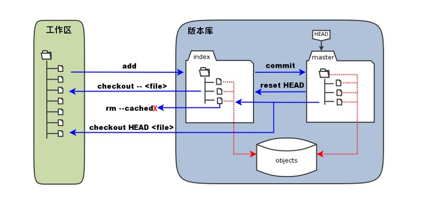
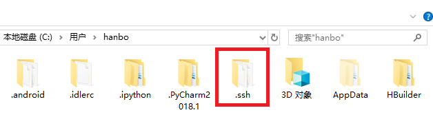
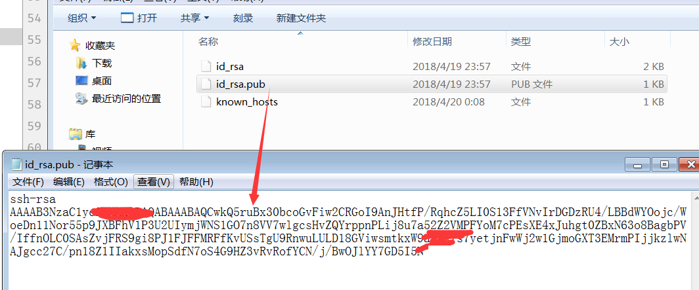

## Git的理解与配置

### 1. 对Git的理解:

#### (1)名词解释:

Git是一个开源的分布式版本控制系统，用于敏捷高效地处理任何或小或大的项目.

#### (2)集中式控制系统与分布式控制系统的区别:

**集中式版本控制 :**主要有SVN。该模式的版本控制是由一台电脑作为中央服务器，程序猿工作的时候用自己的电脑先要从中央服务器上把代码给拉取(pull)下来，然后在编写自己的代码，最后提交代码到中央服务器上。该模式下必须联网才能完成操作。


**分布式控制:** 主要有Git。该模式的版本控制没有中央服务器的概念，每一个程序猿的电脑都是一个版本库。也就是说，每一个程序猿的电脑上都有整个项目的代码，不只是自己版本的代码，还有其他人的版本的代码。所以要是换同事程序猿的电脑挂了，从你的电脑上一样的可以把他写的分支上的代码给copy出来。当然在正式开发中还是有一个类似于中央服务器的一台服务器，我们自己电脑的代码还是需要推到该服务器上，最后通过该服务器整合代码发布到线上测试环境去进行测试以及上线。


```python
在工作中程序员电脑上一般会设计到四个分支:
master(线上分支)，dev(开发环境分支)，test(测试分支)，hanbo(自己开发分支)
```


### 2.配置Git

#### (1)Git 工作区、暂存区和版本库

**工作区**其实就是整个项目的文件目录; 其中有很多一个隐藏文件叫.git，该文件就是git的**版本库**; 在该.git文件中有很多配置文件，最重要的是就是stage或者叫index的**暂存区**; 还有git在我们创建项目的时候默认创建了第一个master分支，以及指向该master分支的一个指针head。说明如图:


**提交代码怎么从本地到缓存区以及最后到远程的分支上的呢:**

```python
1. 首先第一步git add其实就是讲我们本地修改了的代码提交到缓存区中
2. 第二部git commit就是讲我们缓存区中的代码提交到本地分支中，并清空缓存区域
3. 最后一步git push origin master，就是讲我们本地分支的代码推到远程remote的master分支上
```

```python
git提交代码
设置了全局变量以后，在以后的每一次提交代码都会提示输入git的username和password。

git秘钥设置:
1. git支持https和git两种传输协议,其中使用https协议的时候，每次pull, push都会提示要输入密码
2. 使用ssh协议，在配置好秘钥，就可以使用无需每次输入账号密码了
```

#### (2)设置全局变量

```python
1.设置用户名 : git config --global user.name 'handabo'
2.设置用户邮箱 : git config --global user.email '530439558@qq.com'
3.查看是否配置成功 : git config --list
```


#### (3)SSH密钥

**A.生成rsa加密文件**: 

```python
ssh-keygen -t rsa -C "530439558@qq.com"
```

在系统用户目录中生成.ssh文件夹



**B. 配置git中ssh秘钥**
 首先：先查看ssh文件夹的结构，,进入打开id_rsa.pub文件, (id_rsa.pub是公钥文件)，并复制其中的信息
 
***
 其次：打开github，点击setting然后配置ssh秘钥
 


